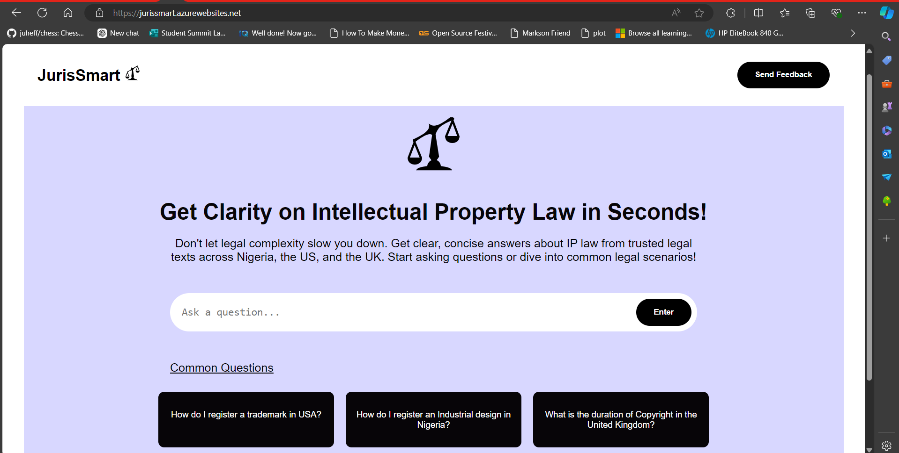

# JurisSmart

**JurisSmart** is a web application designed to assist users in navigating complex legal matters, with a special emphasis on Intellectual Property law. Built using **React.js** for the frontend, **Flask** for the backend, the app leverages **Azure OpenAI** and **Azure Cognitive Search** to provide fast, accurate legal answers. The app retrieves relevant information from legal documents and trusted sources across **Nigeria**, the **USA**, and the **UK** and provides citation-backed answers, ensuring users receive reliable, authoritative responses.



## Table of Contents

- [Introduction](#introduction)
- [Problem Statement](#problem-statement)
- [Solution](#solution)
- [Project Structure](#project-structure)
- [Deployment](#deployment)
- [Technologies Used](#technnologies-used)
- [Installation and Setup](#installation-and-setup)
- [Technologies Used](#technologies-used)
- [API Endpoints](#api-endpoints)


## Introduction

JurisSmart aims to simplify the complexities of IP law by providing users with clear, concise answers to their legal questions. The application uses advanced AI models to generate responses and includes citations from authoritative legal texts.

## Problem Statement

Navigating the complexities of legal documentation, especially in Intellectual Property (IP) law, can be daunting. Legal documents are often challenging to interpret, and finding the relevant information quickly is a struggle for non-experts. JurisSmart simplifies this process by offering a tool that delivers fast, concise, and verifiable legal advice.

## Solution

JurisSmart simplifies access to IP law information by:

- Offering a user-friendly interface to ask legal questions.
- Providing AI-generated responses from Azure OpenAI, and Azure Cognitive Search based on real legal data.
- Citing legal sources dynamically and linking to the original documents.
- Quick access to common legal questions.
- Users can send feedback via email.

## Project Structure

The project is divided into two main parts: the front-end and the back-end.

### Front-end

- **index.html**: Entry point for the React application.
- **package.json**: Contains project metadata and dependencies.
- **src/**: Contains the source code for the React application.
  - **App.jsx**: Main application component.
  - **components/**: Contains reusable React components like `Chat.jsx` and `Navbar.jsx`
  - **main.jsx**: Entry point for the React application.
  - **index.css**: Global CSS styles.

### Backend

- **app.py**: Main Flask application that handles API requests and integrates with Azure OpenAI and Azure Cognitive Search.
- **requirements.txt**: Lists the Python dependencies.

## Deployment

The web application has been deployed and is accessible at [jurissmart.azurewebsites.net](https://jurissmart.azurewebsites.net/)

## Technologies Used

### Frontend

- React
- Vite
- EmailJs

### Backend

- Flask
- Azure OpenAI
- Azure Cognitive Search
- Azure blob storage

## Installation and Setup

### Prerequisites

To set up the app locally, you need:

- Python 3.x
- Azure Account with access to Azure OpenAI and Azure Cognitive Search services

### Backend Setup

1. Clone the repository:

   ```bash
   git clone https://github.com/DevMarkson/jurissmart.git
   cd jurissmart
   cd backend
   ```

2. Install dependencies

   ```bash
   pip install -r requirements.txt
   ```

3. Set up the environment variables in a `.env` file:

   ```bash
   AZURE_OAI_ENDPOINT=<Your Azure OpenAI Endpoint>
   AZURE_OAI_KEY=<Your Azure OpenAI API Key>
   AZURE_OAI_DEPLOYMENT=<Azure OpenAI Deployment Name>
   AZURE_SEARCH_ENDPOINT=<Azure Cognitive Search Endpoint>
   AZURE_SEARCH_KEY=<Azure Cognitive Search Key>
   AZURE_SEARCH_INDEX=<Azure Cognitive Search Index>
   ```

4. Start the flask server

   ```bash
   python app.py
   ```

## API Endpoints

### Request body
- **POST /generate**: Ask a legal question
```
   {
   "prompt": "What are the copyright laws in Nigeria?",
   "settings": {
      "temperature": 0.5,
      "max_tokens": 1000
   },
   "show_citations": true
   }
```

### Response
```
{
  "response": "The copyright laws in Nigeria are primarily governed by the Copyright Act, 2022.
Here are some key points from the Act:\n\n1. **Eligibility for Copyright**:\n   - Copyright is automatically conferred on any eligible work without the need for any formality [1].\n
- Works eligible for copyright include literary, musical, artistic works, audiovisuals, sound recordings, and broadcasts [1].\n
- The author must be a Nigerian citizen, habitually resident in Nigeria, or a body corporate incorporated under Nigerian laws [1].\n\n2.
**Protection of Rights**:\n - The Act aims to protect the rights of authors to ensure they receive just rewards and recognition for their intellectual efforts [1].\n
- It includes provisions to ensure compliance with international copyright treaties and conventions [1].\n\n3.
**Ownership and Joint Ownership**:\n - The author or creator of a work is generally considered the first owner of the copyright [2].\n
- Joint ownership is recognized, where multiple individuals share a joint interest in a copyright [2].\n\n4.
**Transfer and Licensing**:\n   - Transfers or assignments of copyright must be in writing to be effective [2].\n
- Non-exclusive licenses can be written, oral, or inferred from conduct, but exclusive licenses must be in writing [2].\n\n5.
 **Collective Management**:\n   - There are collective management organizations for different types of works, such as the Audio Visual Rights Society of Nigeria (AVRS) for audiovisual works and Reproduction Rights Organization of Nigeria (REPRONIG) for literary works [2].\n\n6. **Miscellaneous Provisions**:\n   - The Act includes provisions for the establishment of a fund for the Nigerian Copyright Commission, financial management, annual reporting, and borrowing powers [1].\n   - It also outlines the powers of the Minister to give directives, indemnity clauses, and transitional provisions [1].\n\nThese points provide a general overview of the copyright laws in Nigeria as per the latest legislation. For a more detailed understanding, one can refer to the full text of the Copyright Act, 2022.",
  "citations": [
    {
      "number": 1,
      "title": "CopyrightAct2023FinalPublication - Nigeria.pdf",
      "pdf_link": "https://www.copyright.gov.ng/wp-content/uploads/2023/04/CopyrightAct2023FinalPublication1.pdf"
    },
    {
      "number": 2,
      "title": "COP24_Chapter-11_Nigeria.pdf",
      "pdf_link": "https://iclg.com/practice-areas/copyright-laws-and-regulations/nigeria"
    },
  ]
}
```
